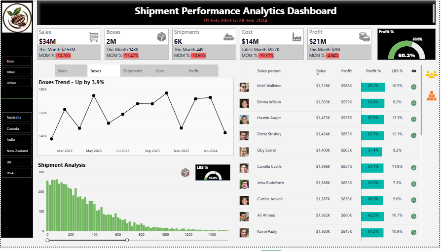
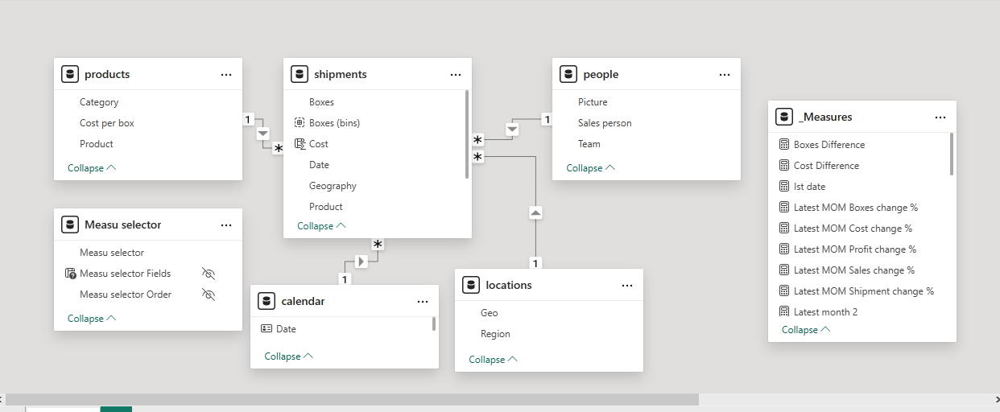
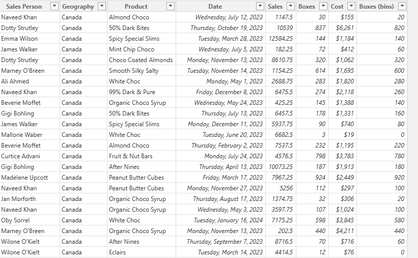

# CocoaCraft Logistics & Shipment Performance Dashboard

## Project Overview

The **CocoaCraft Logistics & Shipment Performance Dashboard** is an interactive Business Intelligence solution developed using **Power BI, DAX, Power Query, and Excel** to monitor logistics operations, shipment performance, sales, profitability, and operational efficiency.

Designed for business stakeholders, the dashboard consolidates key operational metrics into a centralized reporting solution, enabling users to monitor performance trends, evaluate product profitability, compare regional performance, and identify high-performing sales personnel over a **13-month analysis period (01-Feb-2023 to 28-Feb-2024).**

---

## Project Highlights

* Developed an executive-level shipment performance dashboard for business decision support.
* Implemented **DAX Time Intelligence** to calculate dynamic Month-over-Month (MoM) KPI changes.
* Designed a **Star Schema** data model for scalable and efficient reporting.
* Utilized **Field Parameters** to dynamically switch business metrics within a single visual.
* Implemented **Bookmarks** to optimize report navigation and maximize dashboard space.
* Created **dynamic report titles** and **interactive report tooltips** for enhanced user experience.
* Applied conditional formatting and KPI indicators to improve decision-making.
* Replaced tutorial assets with custom branding, generated personnel images, and GitHub-hosted image URLs to create a unique project identity.

---

# Dashboard Preview



---

# Business Objectives

The dashboard was designed to answer key business questions, including:

* How are shipment operations performing over time?
* Are sales and profitability improving month-over-month?
* Which products generate the highest revenue and profit?
* Which regions contribute the most to overall sales?
* Which salespeople consistently deliver strong performance?
* How can business users analyze multiple KPIs without increasing dashboard complexity?

---

# Dashboard Features

## Executive KPI Monitoring

The dashboard tracks:

* Total Sales
* Total Boxes Shipped
* Total Shipments
* Total Cost
* Total Profit
* Profit Margin (%)

Each KPI includes:

* Latest Month Performance
* Dynamic Month-over-Month (MoM) Change
* Conditional KPI Indicators

---

## Interactive Analytics

Users can interactively analyze shipment performance using:

* Product Category Filters
* Region Filters
* Dynamic Measure Selection
* Bookmark-Based Navigation
* Interactive Report Tooltips

---

## Dynamic Measure Switching

Instead of creating multiple visuals for different business metrics, a **Field Parameter** allows users to dynamically switch between:

* Sales
* Boxes
* Shipments
* Cost
* Profit

within the same visual.

This approach reduces report complexity while improving user experience.

---

## Performance Analysis

The dashboard enables users to analyze:

* Shipment Trends
* Product Performance
* Salesperson Performance
* Regional Performance
* Profitability
* Profit Margin
* Operational Efficiency

---

# Key Business Insights

The dashboard enables business users to quickly identify insights such as:

* Total Sales exceeded **$34M** during the reporting period.
* Overall Profit exceeded **$21M** with a Profit Margin above **60%**.
* Month-over-Month KPI tracking highlights operational trends and performance changes.
* Regional filtering enables comparison of shipment activity across multiple geographies.
* Dynamic metric switching allows multiple business perspectives without duplicating visuals.
* Interactive drill-downs and tooltips provide additional analytical context for decision-making.

---

# Data Model



The solution follows a **Star Schema** architecture consisting of:

### Fact Table

* Shipments

### Dimension Tables

* Calendar
* Products
* People
* Locations

Additional supporting tables include:

* Measures Table
* Field Parameter Table

This model improves maintainability, scalability, and reporting performance.

---

# Dataset Preview



The dataset contains shipment-level transactional data, including:

* Date
* Geography
* Product
* Sales
* Boxes
* Cost
* Salesperson Information

---

# Technical Skills Demonstrated

## Power BI

* Dashboard Design
* Interactive Reporting
* Executive KPI Development
* Advanced Data Visualization

## Data Modeling

* Star Schema Design
* Fact & Dimension Modeling
* Relationship Management

## DAX

* Time Intelligence
* Month-over-Month Analysis
* Dynamic KPI Calculations
* Context-Aware Measures

## Power Query

* Data Cleaning
* Data Transformation
* Data Preparation

## Advanced Power BI Features

* Field Parameters
* Bookmarks
* Dynamic Measure Switching
* Dynamic Titles
* Interactive Report Tooltips
* Conditional Formatting

---

# Tools & Technologies

* Power BI Desktop
* DAX
* Power Query
* Microsoft Excel
* Data Modeling
* Field Parameters
* Bookmarks

---

# Repository Structure

```text
cocoacraft-shipment-performance-dashboard
│
|-- Dataset
|-- Documentation
|-- Images
|-- PowerBI
|-- screenshots
|--  README.md
```

---

# About This Project

This project was developed to demonstrate practical Business Intelligence skills by combining advanced Power BI capabilities with sound data modeling principles and business-focused dashboard design.

Rather than focusing solely on visualization, emphasis was placed on creating an interactive reporting solution that supports business users in monitoring operational performance, analyzing profitability, and making informed decisions through dynamic analytics.

---

# Author

**Haroon Rashid**

**Data Analyst | Power BI | SQL | Business Intelligence**

Feel free to connect with me on LinkedIn or explore my other analytics projects on GitHub.
